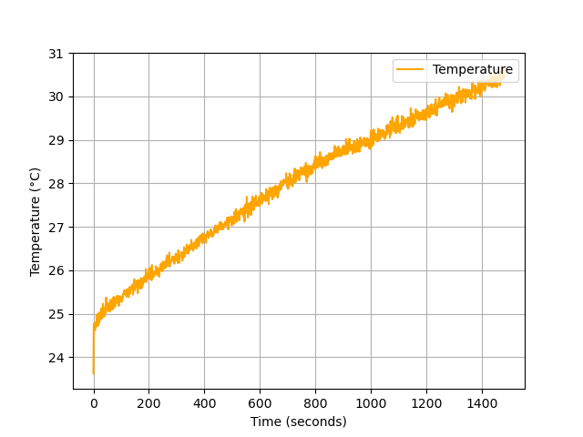
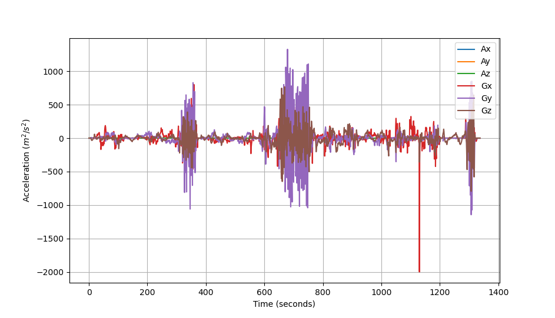
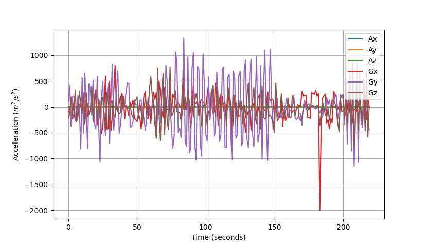
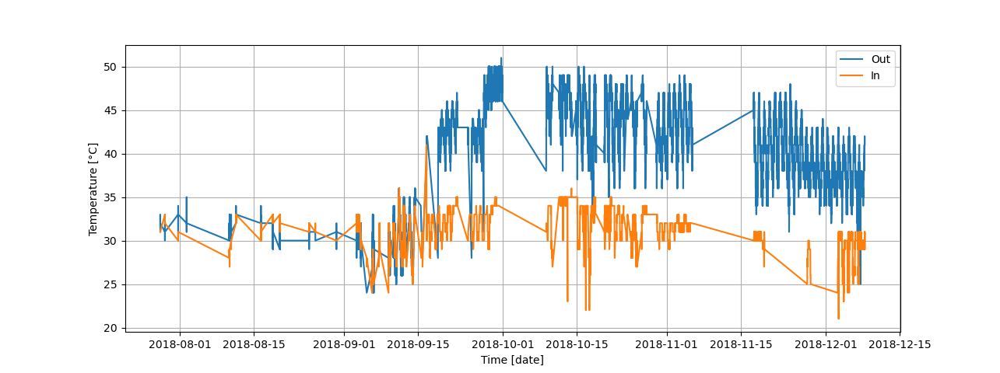
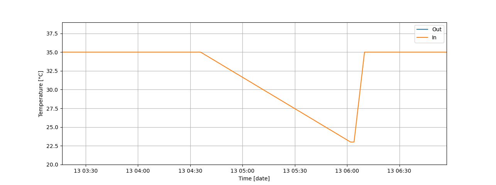
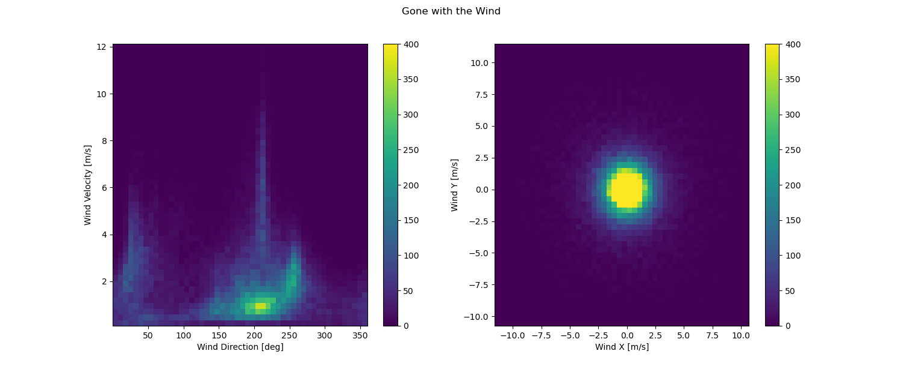

# Lab 2
___
# A2.1 - Temperature Logging and Collection
[Data here](./data/temperature_float.csv)

Noisy, unfiltered data.

# A2.2 - Motion Logging
[Data here](./data/move.csv)

Data before compression

Data after compression, all columns with values between -200 and 200 have been dropped.

# A2.3 - Frozen! 

Full data plotted.

Zoomed in, we can observe the changes per hour.

Processed data [here](./data/iot-temp-processed.csv)

# A2.4 - Digital Health

# A2.5 - Gone with the Wind!
[Data here](./data/wind.csv)

